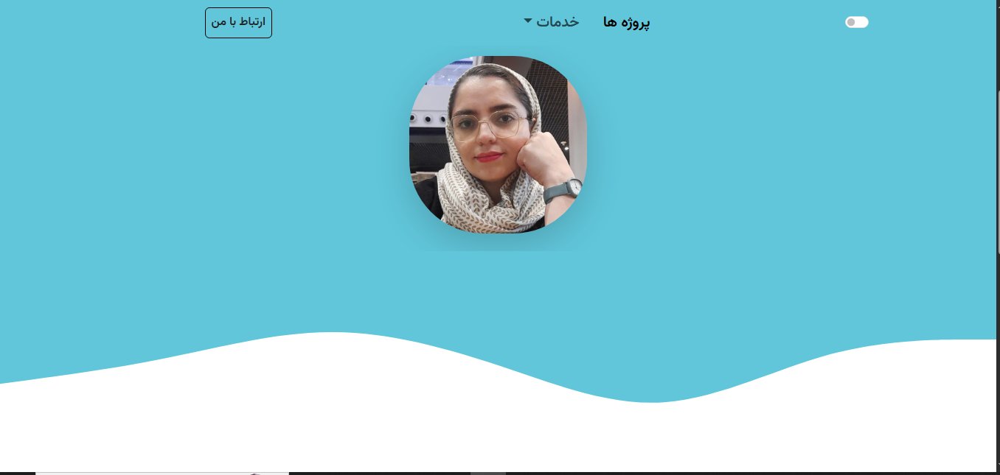

# MyResume-bootstrap 

 
 

 #### *an RTL  resume website*

## list of contents
- [Introduction](#Introduction)
- [Installation](#Installation)
- [Features](#Features)
- [Technologies Used](#Technologies-Used)
- [Preview](#Preview)
- [Roadmap](#Roadmap)
- [License](#License)
- [Contact](#Contact)


## Introduction
A website to learn about someone, their skills and work experiences.

## Installation
 1- Clone the repository  
  ```bash
  git clone https://github.com/ParvinBahram/myresume-bootstrap.git
  ```

 2- Navigate to the project directory :
```bash 
cd repository-name
```


## Features
 1- The is  a fully responsive and mobile-first website.

 2- Available in both light and dark modes .


## Technologies Used
 Created  with **HTML** , **CSS** ,**JavaScript** , **Bootstrap** .

## Preview



## Roadmap
Currently, the site is static and only represents the layout. JavaScript will be added to make it dynamic.

## License
No license restrictions — free to use for everyone.

## Contact

📧 Email: example@email.com
